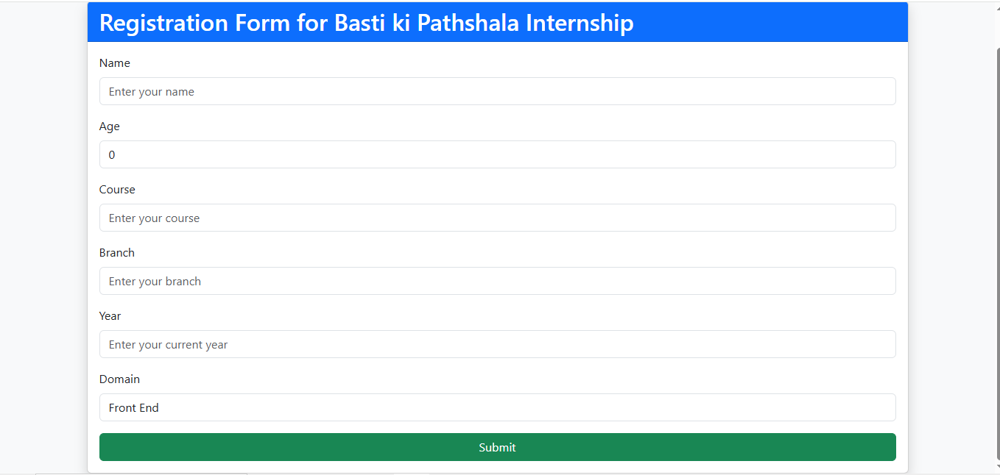
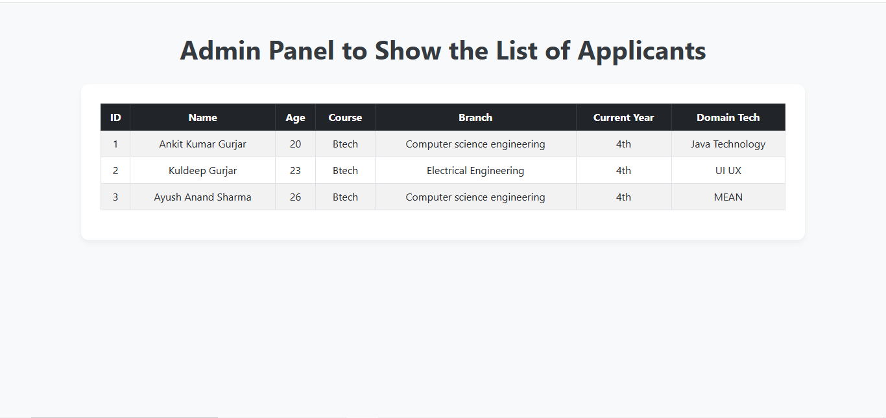

# 📌 Registration Form - Full Stack Internship Project

This is a **fully functional Full Stack web application** built as part of an internship assignment. The application allows users to register using a form, and the submitted applicant details are then stored and displayed in an admin dashboard.

---

## 🚀 Features

- ✅ Registration form to collect applicant data  
- ✅ Stores data in database (using Spring Boot backend)  
- ✅ Admin panel to view the list of all applicants  
- ✅ Professional UI with form validations  
- ✅ Easy to run locally  

---

## 🖥️ Preview

### 📝 Registration Page


### 📋 Applicant List Page



---

## 🔗 Live Demo / 🎥 Walkthrough Video

Watch the full walkthrough of the project implementation on [LinkedIn](https://www.linkedin.com/posts/ankit-kumar-gurjar_java-internship-bastikipathshala-activity-7357814241472462848-Bnwk?utm_source=share&utm_medium=member_desktop&rcm=ACoAAEurwAoB45T1SgXmuQMZr2xTYkHPCSYesjQ)


---

## 📍 How to Use This Project Locally

Follow these steps to run the project on your system:
---
### 🔧 Prerequisites

- Java 17 or above  
- Maven  
- MySQL (or your preferred DB)  
- Any IDE (like IntelliJ or Eclipse)  
---
### ⚙️ Setup Instructions

#### 1️⃣ Clone the Repository

```bash
git clone https://github.com/ankitdoi-coder/Registration-Form-Java-Project.git
cd Registration-Form-Java-Project
```

#### 2️⃣ Configure the Database

- Open the application.properties file
- Update your H2 credentials:
```bash spring.application.name=RegForm
spring.datasource.url=jdbc:h2:mem:testdb
spring.datasource.driverClassName=org.h2.Driver
spring.datasource.username=sa
spring.datasource.password=
spring.jpa.database-platform=org.hibernate.dialect.H2Dialect
spring.h2.console.enabled=true
spring.h2.console.path=/h2-console
spring.jpa.hibernate.ddl-auto=update

```
#### 3️⃣ Build and Run the Project

```bash
mvn spring-boot:run
```
---

#### 🌐 Access the App Locally
- To register an applicant, go to: http://localhost:8080/
- To view the list of applicants, go to: http://localhost:8080/admin

---

#### ✨ Technologies Used
- Frontend: HTML, CSS, Bootstrap, Thymeleaf
- Backend: Java, Spring Boot
- Database: H2
- Build Tool: Maven

  ---

#### 💼 Why I Built This
This project was developed as part of my application for a Full Stack Development Internship. It demonstrates:
- My understanding of front-end and back-end development
- Clean code and modular architecture
- Real-world functionality (form submission, persistence, admin panel)
---
#### 💡 Suggestions to Reviewer
- You can test the full flow by registering a few entries and checking them via the /admin route.
- Please refer to the video walkthrough for a smooth demo experience.
- The project structure and clean UI aim to demonstrate production-level quality within the scope of the assignment.
---

#### 📩 Contact
If you have any queries or suggestions, feel free to connect:
- Name: Ankit Kumar Gurjar
- Email: ankitdoi82@gmail.com
- LinkedIn: linkedin.com/in/ankit-kumar-gurjar
